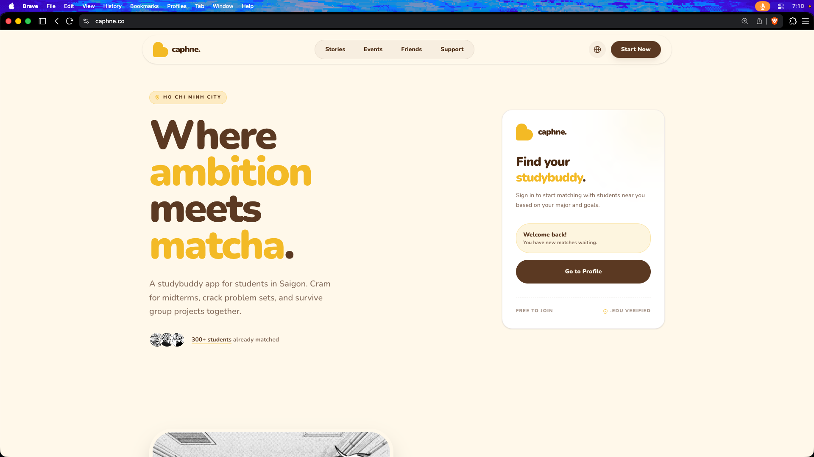

<p align="center">
  
</p>

<h1 align="center">Caphne StudyBuddy</h1>

<p align="center">
  ☕️ <b>Tinder, but for finding study buddies.</b> &nbsp;(pronounced <code>caff-nee</code>)
</p>

<p align="center">
  <a href="https://caphne.co"><b>caphne.co</b></a> — live, with 300+ students across FPT University campuses
</p>

<p align="center">
  
</p>

---

## Contributors

<a href="https://github.com/suka712/caphne-studybuddy/graphs/contributors">
  
</a>

<!-- Tip: add each person's name + what they owned (frontend / backend / infra). Recruiters read this. -->

📧 khiem@sukaseven.com · anh.tranduy1156@gmail.com

---

## What it does

Fill in your major, year, goals, and vibe — Caphne matches you with compatible study partners, then lets you chat and meet up.

- **🧐 Smart matching** — paired on major, year, goals, and interests. Not feeling today's matches? Swipe on and reroll.
- **💬 Real-time chat** — Socket.io messaging with browser push notifications, so you never miss a message.
- **🧭 Discover** — browse a directory of students who've opted their profile public.
- **🙋 Your profile, your control** — flip visibility public/private, edit everything inline.

Sign up with email, Google, or GitHub at **[caphne.co](https://caphne.co)**.

---

## Tech stack

| Layer | Tech |
| --- | --- |
| **Frontend** | Nuxt 4, Vue 3, shadcn-vue, Tailwind CSS |
| **Backend** | Express, Socket.io |
| **Database** | PostgreSQL + Drizzle ORM |
| **Auth** | Email (Resend) + OAuth via Passport.js (Google, GitHub) |
| **Infra** | Terraform on AWS · CI/CD with GitHub Actions & GitLab CI |
| **Tooling** | pnpm workspaces (monorepo), TypeScript end to end |

---

## Architecture

A pnpm monorepo:

```
apps/
  client/     Nuxt frontend
  server/     Express API + Socket.io gateway
packages/     shared types & socket-event contracts
infra/        Terraform modules (frontend + backend) on AWS
```

Chat runs over Socket.io against a **shared event contract in `packages/`**, so the client and server can't drift on message shapes. Infrastructure is fully codified in `infra/` and shipped by the pipelines in `.github/workflows/` and `.gitlab-ci.yml`.

---

## Local development

**Prerequisites:** Node ≥ 24, pnpm 9, and a PostgreSQL database.

```bash
# 1. Install
pnpm install

# 2. Env — copy the examples, then fill in your values
cp apps/server/.env.example apps/server/.env
cp apps/client/.env.example apps/client/.env

# 3. Database
pnpm --filter=server db:migrate
pnpm --filter=server db:seed      # optional — demo data

# 4. Run client + server together
pnpm dev
```

Other scripts: `pnpm dev:client`, `pnpm dev:server`, `pnpm lint`, `pnpm check-types`, `pnpm format`.

---

## Contributing

PRs welcome. Fork the repo, branch off with an `f/` prefix (e.g. `f/your-feature`), and open a pull request.

---

## Contact

Questions, ideas, or feature requests: **khiem@sukaseven.com** or **anh.tranduy1156@gmail.com**

---

<p align="center"><sub>MIT License · Made in Ho Chi Minh City ☕️</sub></p>
